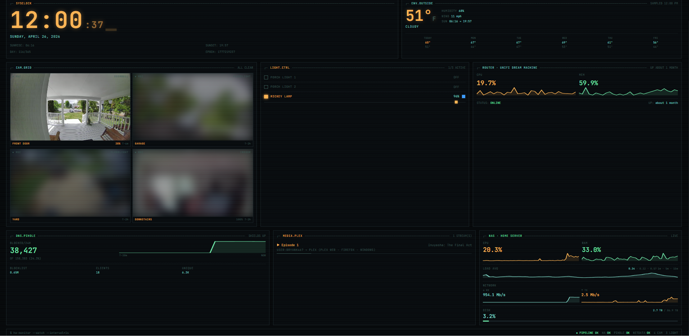

# HA Dashboard

A self-hosted home monitoring dashboard with a retro terminal (CRT) aesthetic. Built with React + Vite, served via nginx in Docker.



## Features

- **Cameras** — Ring camera snapshots with motion alerts, live WebRTC/HLS streams, privacy blur until clicked
- **Lights** — WiZ RGBWW light controls (toggle, brightness, color)
- **Weather** — Current conditions + 7-day forecast via Home Assistant
- **Pi-hole** — DNS block stats and query history sparkline
- **Plex** — Active session monitoring with progress bars
- **Router** — UniFi Dream Machine CPU, RAM, and uptime
- **NAS** — Netdata live metrics: CPU, RAM, load average, network I/O, disk space, temperatures
- **Responsive** — Desktop, tablet, and mobile layouts

## Architecture

```
Browser → nginx (port 3000→80)
            ├── /               → React SPA (built by Vite)
            ├── /api/pihole/*   → proxy → Pi-hole :8181
            └── /api/netdata/*  → proxy → Netdata :19999

React SPA → Home Assistant WebSocket (:8123/api/websocket)
            (lights, cameras, weather, Plex, Ring sensors, UniFi)
```

## Prerequisites

- Docker + Docker Compose
- [Home Assistant](https://www.home-assistant.io/) (any recent version)
- Pi-hole v6 (optional)
- Netdata (optional — NAS card shows OFFLINE if unreachable)

---

## Quick Start

**1. Clone the repo**
```bash
git clone https://github.com/HeyLetsGoState/home_assist.git
cd home_assist
```

**2. Create your `.env` file**
```bash
cp .env.example .env
```
Fill in your values — see [Environment Variables](#environment-variables).

**3. Configure your entity IDs**

Open `src/config.js` and replace the entity IDs with your own. See [Home Assistant Setup](#home-assistant-setup) for how to find them.

**4. Build and run**
```bash
docker compose up --build
```

Dashboard is at `http://localhost:3000`.

---

## Environment Variables

Copy `.env.example` to `.env` and fill in:

| Variable | Description | Example |
|---|---|---|
| `VITE_HA_URL` | Home Assistant URL — no trailing slash | `http://192.168.1.10:8123` |
| `VITE_HA_TOKEN` | HA long-lived access token (see below) | `eyJ...` |
| `VITE_PIHOLE_PASSWORD` | Pi-hole admin password | `hunter2` |
| `PIHOLE_HOST` | Pi-hole `host:port` for the nginx proxy | `192.168.1.10:8181` |
| `NETDATA_HOST` | Netdata `host:port` for the nginx proxy | `192.168.1.10:19999` |

> `VITE_*` variables are baked into the JS bundle at build time — changing them requires a rebuild. `PIHOLE_HOST` and `NETDATA_HOST` are injected into nginx at container startup and only require a container restart to change.

---

## Home Assistant Setup

### 1. Create a Long-Lived Access Token

1. In HA, click your profile avatar (bottom-left)
2. Scroll to **Security → Long-lived access tokens**
3. Click **Create token**, name it (e.g. `dashboard`), and copy the value
4. Paste it into `VITE_HA_TOKEN` in your `.env`

### 2. Find Your Entity IDs

Every sensor, light, camera, and device in HA has a unique entity ID. To find yours:

1. Go to **Settings → Developer Tools → States**
2. Use the search/filter box to find your devices
3. The entity ID is shown in the left column (e.g. `light.living_room`, `sensor.front_door_battery`)

### 3. Configure `src/config.js`

Open `src/config.js` and update each section to match your setup:

#### Lights
```js
lights: [
  { id: 'light.your_bulb_entity_id', name: 'Display Name' },
  // Add as many as you want
]
```
Supports any HA light entity. WiZ RGBWW bulbs will get the color picker; plain on/off lights will just get the toggle and brightness slider.

#### Cameras
```js
cameras: [
  {
    id: 'sensor.front_door_last_activity', // motion/activity sensor — state is a timestamp
    name: 'Front Door',                    // display name
    icon: 'doorbell',                      // label shown on the tile (any string)
    timeFrom: 'state',                     // 'state' = use sensor state as timestamp
    cameraId: 'camera.front_door_live_view', // camera entity for snapshots + live stream
    batteryId: 'sensor.front_door_battery',  // optional: battery sensor
    private: true,                           // optional: blur image until clicked
  },
]
```

**Finding Ring camera entities:**
- Motion sensor: search for `sensor.*_last_activity`
- Camera entity: search for `camera.*_live_view`
- Battery: search for `sensor.*_battery`

Ring cameras support live view via WebRTC (tried first) with HLS as a fallback. Both require the [Ring integration](https://www.home-assistant.io/integrations/ring/) to be configured in HA.

#### Weather
```js
weather: 'weather.forecast_home'
```
Search HA states for `weather.` to find your entity. Common values: `weather.forecast_home`, `weather.home`. Requires any HA weather integration (Met.no, OpenWeatherMap, etc.).

#### UniFi Router
```js
unifi: {
  cpu:    'sensor.your_udm_cpu_utilization',
  memory: 'sensor.your_udm_memory_utilization',
  state:  'sensor.your_udm_state',
  uptime: 'sensor.your_udm_uptime',
}
```
Requires the [UniFi integration](https://www.home-assistant.io/integrations/unifi/). Search HA states for your device name to find the exact entity IDs.

#### Plex
The Plex card auto-discovers active sessions by looking for any `media_player.plex_*` entity in the `playing` or `paused` state — no configuration needed. Requires the [Plex integration](https://www.home-assistant.io/integrations/plex/).

---

## Pi-hole Setup

Requires Pi-hole v6. The dashboard authenticates using your admin password via the v6 REST API (`/api/auth`).

Set `VITE_PIHOLE_PASSWORD` in `.env` and `PIHOLE_HOST` to the IP and port of your Pi-hole instance.

> **Port note:** Pi-hole v6's default API port is `8080`, not `8181`. If you installed Pi-hole with a custom port (e.g. running alongside other services), use that port instead. Check your Pi-hole admin panel URL to confirm.

---

## Netdata Setup

Install [Netdata](https://www.netdata.cloud/) on your server/NAS. No authentication is required — the dashboard queries the local v1 REST API directly.

Set `NETDATA_HOST` in `.env` to the IP and port (default: `19999`).

The dashboard auto-detects:
- The primary network interface (skips loopback/docker bridges)
- All real disk mounts (skips tmpfs/overlay)
- All temperature sensors reported in Celsius

---

## NAS / Synology Deployment (without Docker Compose)

Use the included PowerShell script to build a portable image:

```powershell
# Set build-time env vars before running
$env:VITE_HA_URL = "http://192.168.1.10:8123"
$env:VITE_HA_TOKEN = "eyJ..."
$env:VITE_PIHOLE_PASSWORD = "yourpassword"

.\build-and-export.ps1
```

This builds the Docker image, exports it as `ha-dashboard.tar.gz`, and opens the folder. Upload the file to your NAS and import via Docker Manager.

In the Docker Manager container settings, add environment variables for `PIHOLE_HOST` and `NETDATA_HOST` before starting the container.

---

## Development

```bash
cp .env.example .env   # fill in your values
npm install
npm run dev            # dev server on :3000 with API proxies active
```

Changes hot-reload. The Vite dev server proxies `/api/pihole` and `/api/netdata` using the hosts from your `.env`.

---

## Troubleshooting

**`WS:CONNECTING` stuck / everything shows offline**
- Check `VITE_HA_URL` — must be reachable from your browser, no trailing slash
- Check `VITE_HA_TOKEN` — generate a new one in HA → Profile → Security if unsure
- Make sure your HA instance allows external WebSocket connections

**Pi-hole shows `UNREACHABLE`**
- Verify `PIHOLE_HOST` is correct (IP:port, no `http://`)
- Default Pi-hole v6 port is `8080` — confirm in your Pi-hole admin panel URL
- Check `VITE_PIHOLE_PASSWORD` matches your Pi-hole admin password

**Netdata shows `OFFLINE`**
- Verify `NETDATA_HOST` is correct and Netdata is running (`http://your-nas:19999` should load)
- Check nginx logs: `docker compose logs dashboard`

**Camera tiles are blank**
- Verify the `cameraId` entity exists in HA (search `camera.*` in Developer Tools → States)
- The Ring integration must be configured and connected in HA

**Network card shows `0 kb/s`**
- The dashboard auto-detects your network interface — check browser console for `[Netdata] using interface:` to see what it picked
- If wrong, the interface name can be found at `http://your-nas:19999/api/v1/charts` — search for `net.` entries

**Cameras still blurred after clicking**
- First click reveals the image, second click opens the live stream modal — this is intentional

---

## Tech Stack

- [React](https://react.dev/) + [Vite](https://vitejs.dev/)
- [hls.js](https://github.com/video-dev/hls.js/) — HLS stream fallback for Ring cameras
- [date-fns](https://date-fns.org/) — relative time formatting
- nginx 1.27 alpine — production server + CORS proxy
- Node 20 alpine — build stage
